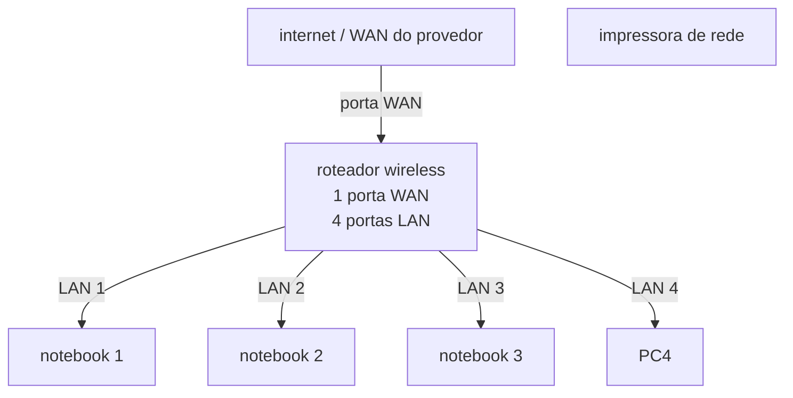

# laboratório de redes 01 - projeto de rede local

aluno:david

professoar:jose de assis

data: 09/03/2026

---

## 1. objetvo
implementar uma rede local simples conectanto 3 notebooks a um roteador wirelesss com switch e uma impressoara de rede 

o projeto será dividido em duas etapas:
1. simulação de rede do cisco packet tracer
2. implementação de rede no laboratório real

 ---

## 2. equipamentos ultilizados nesse laboratório:-3 notebooks
-1 roteador wireless com 1 porta WAN e a 4 portas LAN
-1 impressora de rede
- cabos de rede
  
  ---
## 3. topologia de rede 

  diagrama lógico da rede usada neste laboratório.

imagem da topologia usada neste laboratório:
. (topologia>png).

---
## 4. plano de endereçamento ip

rede:192.168.0.0/24
gateway: 192.168.0.1

| dispositivo | tipo de ip | endereço ip | observação |
|-------------|-------------|-------------|-------------|
| roteador | Estático | 192.168.0.1 | ip do roteador |
| impressora | reserva DHCP | 192.168.0.103 | ip reservado pelo roteador |
| PC1 | reserva DHCP | 192.168.0.105 | ip reservado pelo roteador |
| PC2 | DHCP | automatico | ip atribuido pelo roteador|
| PC3 | DHCP | automatico | ip atribuido pelo roteador |

## observação

-a impressora e um dos notebooks utilizam resrvar DHCP.
-o roteador sempre atribui o mesmo endereço ip a esses dispositivos.

---

## 5. implementaçao,a rede real
apos a instalação ,a rede foi montada fisicamente no laboratório

(fotos e capturas de tela realizados durante o laboratorio

testes:
(fotos e capturas de tela realizados durante o laboratorio

---

## 6. conclusão

este laboratorio  permitiu compreender o funcionamento de uma rede local simples ,incluindo:

-estrutura de uma rede domestica, ou de um pequeno escritório (rede local)
-ultilização de um roteadorcom WAN e portas LAN 
-fucionamento do  DHCP
-comunicação entre dispositivos na rede local 
-ultilização de uma impressora de rede 
-compartilhamento de uma pasta na rede usando o windows
-jogos na rede
